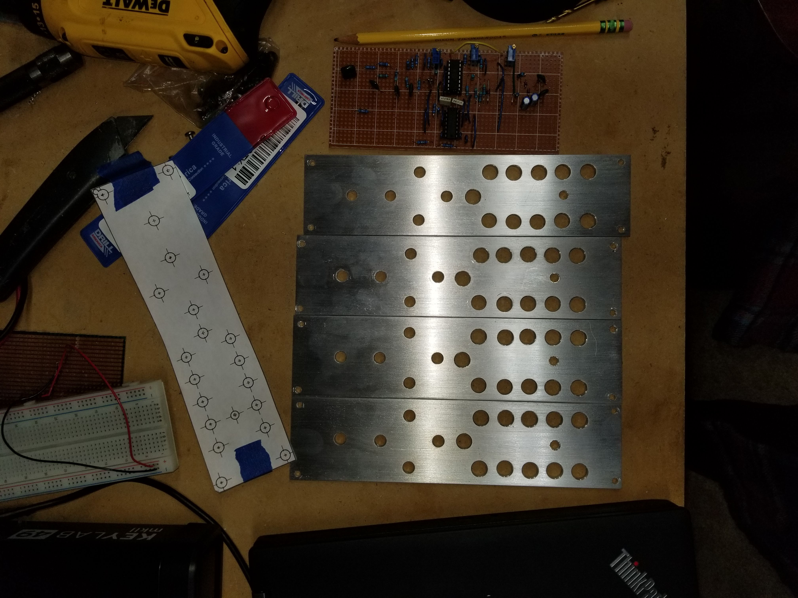

# Modular-Synthesizer

A DIY modular synthesizer.

Made from module circuit designs found from various places online.

Panel designs made by me in fusion 360 for my 2"x8" module format.
Panels are made from 2"x8" aluminum flat bar blanks.

Empty VCO Panels:

